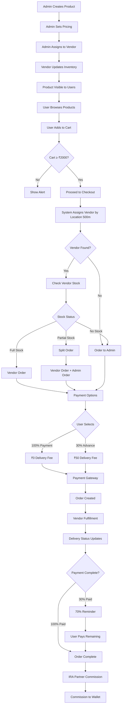
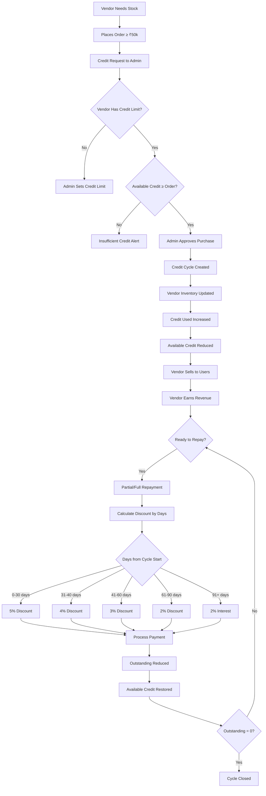
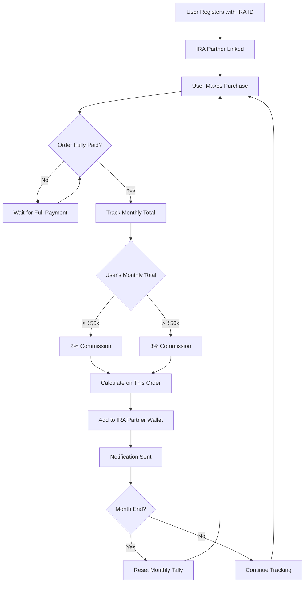

# END-TO-END SYSTEM WORKFLOW & COMPREHENSIVE TESTING PLAN
**SatPura Bio - FarmCommerce Platform**
**Version**: 1.0.0  
**Date**: 2026-01-25

---

## 📋 TABLE OF CONTENTS

1. [System Overview](#system-overview)
2. [Complete Workflow Diagrams](#complete-workflow-diagrams)
3. [Detailed Role Workflows](#detailed-role-workflows)
4. [Comprehensive Testing Plan](#comprehensive-testing-plan)
5. [Edge Cases & Error Scenarios](#edge-cases--error-scenarios)
6. [Integration Points](#integration-points)
7. [Critical Business Rules](#critical-business-rules)

---

## 1. SYSTEM OVERVIEW

### 1.1 Platform Architecture

```
┌─────────────────────────────────────────────────────────────┐
│                     ADMIN DASHBOARD                          │
│  - Product Management                                        │
│  - Vendor Approval (500m radius enforcement)                 │
│  - IRA Partner (Seller) Management                           │
│  - Order Oversight & Escalation Handling                     │
│  - Credit Limit & Policy Management                          │
│  - Commission Approval & Payouts                             │
└─────────────────────────────────────────────────────────────┘
              ↓                    ↓                    ↓
    ┌─────────────┐      ┌─────────────┐      ┌─────────────┐
    │   VENDOR    │      │ IRA PARTNER │      │    USER     │
    │  DASHBOARD  │      │  (SELLER)   │      │  DASHBOARD  │
    │             │      │  DASHBOARD  │      │             │
    │ - Inventory │      │ - Referrals │      │ - Browse    │
    │ - Orders    │      │ - Wallet    │      │ - Cart      │
    │ - Credit    │      │ - Commission│      │ - Orders    │
    │ - Repayment │      │ - Targets   │      │ - Payments  │
    └─────────────┘      └─────────────┘      └─────────────┘
```

### 1.2 Key Business Rules

| Rule | Value | Impact |
|------|-------|--------|
| **Vendor Coverage Radius** | **500 meters (0.5 km)** | Only 1 vendor per 500m radius |
| **Buffer Zone** | 300 meters | Order assignment extended to 800m |
| **Minimum Order Value** | ₹2,000 | Cart validation threshold |
| **Delivery Charge** | ₹50 (waived for 100% payment) | Payment option impact |
| **Advance Payment** | 30% | Split payment option |
| **Remaining Payment** | 70% | Post-delivery payment |
| **Min Vendor Credit Purchase** | ₹50,000 | Credit system threshold |
| **IRA Partner Commission (Tier 1)** | 2% (up to ₹50k/month) | Per user per month |
| **IRA Partner Commission (Tier 2)** | 3% (above ₹50k/month) | Per user per month |
| **Delivery Timeline** | 24 hours | Standard delivery |

---

## 2. COMPLETE WORKFLOW DIAGRAMS

### 2.1 Product Creation to User Purchase - Complete Flow



### 2.2 Vendor Credit Cycle Flow



### 2.3 IRA Partner Commission Flow



---

## 3. DETAILED ROLE WORKFLOWS

### 3.1 ADMIN WORKFLOW

#### Phase 1: System Setup
```
Step 1: Admin Login (Two-Step Auth)
  └─> Email/Password → OTP Verification → Dashboard Access

Step 2: Product Management
  ├─> Create Product (Name, Category, Pricing, Images)
  ├─> Set priceToVendor & priceToUser
  ├─> Upload Images (Cloudinary)
  └─> Set Initial Stock

Step 3: Vendor Management
  ├─> Review Vendor Applications
  ├─> Verify Location (500m radius check)
  ├─> Approve/Reject Vendor
  ├─> Set Credit Limit (if approved)
  └─> Assign Products to Vendor

Step 4: IRA Partner (Seller) Management
  ├─> Create IRA Partner Account
  ├─> Set sellerId (Unique ID)
  ├─> Set Monthly Targets
  └─> Activate Account
```

#### Phase 2: Ongoing Operations
```
Daily Operations:
  ├─> Monitor Orders (User → Vendor/Admin)
  ├─> Handle Escalated Orders (No Vendor/Partial Stock)
  ├─> Review Credit Purchase Requests
  ├─> Approve/Reject Vendor Credit Purchases
  ├─> Process Vendor Repayments
  ├─> Review IRA Partner Payout Requests
  └─> Approve Payout Withdrawals

Monthly Operations:
  ├─> Review IRA Partner Performance
  ├─> Verify Commission Calculations
  ├─> Reset Monthly User Purchase Tallies
  ├─> Generate Reports & Analytics
  └─> Adjust System Policies
```

### 3.2 VENDOR WORKFLOW

#### Registration & Setup
```
Step 1: Vendor Registration
  ├─> Request OTP (Phone)
  ├─> Verify OTP
  ├─> Fill Registration Form
  │   ├─> Name, Shop Name
  │   ├─> Location (Coordinates)
  │   ├─> Business License
  │   └─> Bank Details
  └─> Submit for Admin Approval

Step 2: Wait for Approval
  ├─> Admin Verifies 500m Radius Rule
  ├─> Admin Sets Credit Limit
  └─> Vendor Status: Approved

Step 3: Initial Setup
  ├─> View Assigned Products
  ├─> Update Local Inventory
  └─> Set Operating Hours
```

#### Daily Operations
```
Order Management:
  ├─> Receive New Order Notification
  ├─> Check Stock Availability
  ├─> Decision:
  │   ├─> Full Stock → Accept Order
  │   ├─> No Stock → Reject → Admin Handles
  │   └─> Partial Stock → Accept Partial
  ├─> Update Order Status:
  │   ├─> Awaiting
  │   ├─> Dispatched
  │   └─> Delivered
  └─> User Notified Real-Time

Credit Management:
  ├─> Check Available Credit
  ├─> Place Credit Purchase (≥ ₹50k)
  ├─> Wait for Admin Approval
  ├─> Receive Stock
  ├─> View Active Credit Cycles
  ├─> Make Partial/Full Repayments
  └─> Track Discount Earned
```

### 3.3 IRA PARTNER (SELLER) WORKFLOW

```
Step 1: Registration
  ├─> OTP Login
  ├─> Fill Profile (Name, Area, Bank)
  ├─> Get Unique sellerId
  └─> Wait for Admin Approval

Step 2: User Acquisition
  ├─> Share sellerId with Users
  ├─> User Registers with sellerId
  └─> User Linked to IRA Partner

Step 3: Commission Tracking
  ├─> View Referred Users List
  ├─> Track Each User's Monthly Purchases
  ├─> Auto-Commission on Fully Paid Orders:
  │   ├─> Up to ₹50k/user/month → 2%
  │   └─> Above ₹50k/user/month → 3%
  ├─> Commission Added to Wallet
  └─> View Total Earnings

Step 4: Payout Management
  ├─> Check Wallet Balance
  ├─> Request Withdrawal (Min Amount)
  ├─> Submit Bank Details
  ├─> Admin Approves Payout
  └─> Funds Transferred

Step 5: Performance Tracking
  ├─> View Monthly Targets
  ├─> Track Achievement %
  ├─> View Commission Reports
  └─> Receive Performance Alerts
```

### 3.4 USER WORKFLOW

```
Step 1: Onboarding
  ├─> Download App
  ├─> Select Language
  ├─> Request OTP
  ├─> Verify OTP
  ├─> Registration:
  │   ├─> Name, Phone
  │   ├─> Location (for Vendor Assignment)
  │   └─> Optional: Enter IRA Partner ID (sellerId)
  └─> Account Created

Step 2: Shopping
  ├─> Browse Products by Category
  ├─> View Product Details (Price, Stock, Delivery)
  ├─> Add to Cart
  ├─> Update Quantities
  └─> View Cart Total

Step 3: Checkout
  ├─> Verify Cart ≥ ₹2,000
  ├─> System Auto-Assigns Vendor (500m)
  ├─> Add/Select Delivery Address
  ├─> Choose Payment Option:
  │   ├─> 100% Payment → Free Delivery
  │   └─> 30% Advance → ₹50 Delivery
  ├─> Payment Gateway (Razorpay/Paytm)
  └─> Order Confirmation

Step 4: Order Tracking
  ├─> View Order Status Real-Time:
  │   ├─> Pending → Awaiting
  │   ├─> Dispatched → In Transit
  │   └─> Delivered → Complete
  ├─> Vendor Contact Info
  └─> Estimated Delivery Time

Step 5: Post-Delivery (30% Payment)
  ├─> Receive 70% Payment Reminder
  ├─> Pay Remaining Amount
  ├─> Order Marked Fully Paid
  └─> IRA Partner Commission Triggered

Step 6: Ongoing
  ├─> View Order History
  ├─> Track IRA Partner Savings (if linked)
  ├─> Add Product Reviews
  └─> Manage Addresses
```

---

## 4. COMPREHENSIVE TESTING PLAN

### 4.1 TEST CATEGORIES

#### A. AUTHENTICATION TESTING

| Test ID | Scenario | Steps | Expected Result |
|---------|----------|-------|-----------------|
| AUTH-001 | Admin Two-Step Login | Email/Password → OTP Request → OTP Verify → Access | JWT Token, Dashboard Access |
| AUTH-002 | Vendor OTP Registration | Request OTP → Verify → Fill Form → Submit | Account Created, Pending Approval |
| AUTH-003 | IRA Partner OTP Login | Request OTP → Verify → Login | JWT Token, Dashboard Access |
| AUTH-004 | User OTP Login with sellerId | Request OTP → Verify → Enter sellerId → Login | Linked to IRA Partner |
| AUTH-005 | Invalid OTP | Enter Wrong OTP | Error: Invalid OTP |
| AUTH-006 | Expired OTP | Wait 5+ minutes → Enter OTP | Error: OTP Expired |
| AUTH-007 | Duplicate Phone Registration | Register with Existing Phone | Error: Phone Already Registered |

#### B. PRODUCT MANAGEMENT TESTING

| Test ID | Scenario | Steps | Expected Result |
|---------|----------|-------|-----------------|
| PROD-001 | Admin Creates Product | Fill Form → Upload Images → Submit | Product Created, Active |
| PROD-002 | Product with Attributes | Create Product → Add Size Variants (250ml, 500ml, 1L) → Set Prices | Attributes Saved, Min Price Displayed |
| PROD-003 | Assign Product to Vendor | Select Product → Select Vendor → Assign | Vendor Inventory Updated |
| PROD-004 | User Views Product | Browse → Click Product | Displays Min Price from Attributes |
| PROD-005 | Product Stock Depletion | User Orders Last Unit | Stock = 0, Out of Stock |
| PROD-006 | Admin Updates Product Price | Edit Product → Change priceToUser → Save | New Price Reflected in User App |

#### C. VENDOR RADIUS TESTING (Critical - 500m)

| Test ID | Scenario | Steps | Expected Result |
|---------|----------|-------|-----------------|
| VRAD-001 | First Vendor Registration | Submit with Coordinates | Approved (No Conflict) |
| VRAD-002 | Second Vendor 500m Away | Submit 500m from V1 | Rejected (Within Radius) |
| VRAD-003 | Second Vendor 501m Away | Submit 501m from V1 | Approved (Outside Radius) |
| VRAD-004 | User 300m from Vendor | Place Order | Assigned to Vendor |
| VRAD-005 | User 600m from Vendor | Place Order | Order to Admin (No Vendor in 800m) |
| VRAD-006 | Multiple Vendors in City | 10 Vendors spaced >500m | All Approved |
| VRAD-007 | Vendor Relocation | Update Location to 400m from Another | Rejected if Conflict |

#### D. ORDER WORKFLOW TESTING

| Test ID | Scenario | Steps | Expected Result |
|---------|----------|-------|-----------------|
| ORD-001 | **Full Payment Order** | Cart ₹5,000 → 100% Payment → Checkout | Delivery Fee = ₹0, Order Created |
| ORD-002 | **Split Payment Order** | Cart ₹5,000 → 30% Payment → Checkout | Delivery Fee = ₹50, Pay ₹1,550 |
| ORD-003 | **Below Minimum Order** | Cart ₹1,500 → Checkout | Error: Min ₹2,000 Required |
| ORD-004 | **Full Stock Availability** | Vendor has all items → Order | Assigned to Vendor |
| ORD-005 | **No Stock Availability** | Vendor has 0 items → Order | Escalated to Admin |
| ORD-006 | **Partial Stock** | Vendor has 3/5 items → Order | Split: Vendor (3) + Admin (2) |
| ORD-007 | **Vendor Accepts Order** | Vendor → Accept → Update Status | User Sees "Awaiting" |
| ORD-008 | **Vendor Rejects Order** | Vendor → Reject | Order to Admin |
| ORD-009 | **Status Update Cycle** | Awaiting → Dispatched → Delivered | Real-Time User Updates |
| ORD-010 | **70% Remaining Payment** | Order Delivered → Pay Remaining | Order Fully Paid, Commission Triggered |
| ORD-011 | **Order Cancellation (Before Dispatch)** | User Cancels Awaiting Order | Refund Initiated |
| ORD-012 | **Multiple Orders Same Day** | User places 3 orders | Each Independent Fulfillment |

#### E. VENDOR CREDIT CYCLE TESTING

| Test ID | Scenario | Steps | Expected Result |
|---------|----------|-------|-----------------|
| CRED-001 | **First Credit Purchase** | Vendor → Order ₹50k → Admin Approves | Cycle #1 Created, Credit Used = ₹50k |
| CRED-002 | **Exceeds Credit Limit** | Available ₹30k → Order ₹40k | Error: Insufficient Credit |
| CRED-003 | **Partial Repayment (5% Discount)** | Cycle ₹50k → Repay ₹10k on Day 20 | Pay ₹9,500, Outstanding = ₹40k, Credit Restored ₹10k |
| CRED-004 | **Multiple Active Cycles** | Cycle #1 ₹50k + Cycle #2 ₹60k | Independent Tracking, Total Outstanding ₹110k |
| CRED-005 | **Repay Specific Cycle** | Repay ₹20k to Cycle #1 | Cycle #1 Outstanding Reduced, Cycle #2 Unaffected |
| CRED-006 | **Overpayment Prevention** | Cycle Outstanding ₹5k → Attempt ₹7k | Error: Max Allowed ₹5k |
| CRED-007 | **Full Cycle Closure** | Repay Final ₹10k → Outstanding = 0 | Cycle Status: Closed, Full Credit Restored |
| CRED-008 | **Discount Tiers** | Repay Day 25 (5%), Day 35 (4%), Day 50 (3%), Day 70 (2%) | Each Correct Discount Applied |
| CRED-009 | **Interest After 90 Days** | No Repayment for 95 Days → Repay ₹10k | 2% Interest = Pay ₹10,200 |
| CRED-010 | **Notification Triggers** | Cycle Day 60, 90 | Reminders Sent Per Cycle |

#### F. IRA PARTNER COMMISSION TESTING

| Test ID | Scenario | Steps | Expected Result |
|---------|----------|-------|-----------------|
| COMM-001 | **User Linked to IRA Partner** | User Registers with sellerId | IRA Partner Sees New Referral |
| COMM-002 | **First Order (Tier 1)** | User ₹10k Order → Fully Paid | 2% = ₹200 to IRA Wallet |
| COMM-003 | **Monthly Tally Accumulation** | User: Order 1 (₹20k) + Order 2 (₹25k) = ₹45k | Commission on Both at 2% |
| COMM-004 | **Tier Upgrade Mid-Month** | User Total ₹40k → New Order ₹15k (Total ₹55k) | First ₹50k at 2%, Next ₹5k at 3% |
| COMM-005 | **Multiple Users** | IRA Partner has 5 Users, Each ₹30k | Each User Independent Tallies |
| COMM-006 | **Monthly Reset** | Month End → New Month Starts | All User Tallies Reset to ₹0 |
| COMM-007 | **Partial Payment Order** | User Orders ₹10k, Pays 30% | No Commission Until 70% Paid |
| COMM-008 | **Commission on Split Order** | Vendor (₹6k) + Admin (₹4k) → Total ₹10k | Commission on Full ₹10k After Fully Paid |
| COMM-009 | **Payout Request** | IRA Partner → Request ₹5,000 Withdrawal | Admin Approves → Bank Transfer |
| COMM-010 | **Insufficient Wallet Balance** | Request ₹10k, Balance ₹5k | Error: Insufficient Funds |

#### G. PAYMENT GATEWAY TESTING

| Test ID | Scenario | Steps | Expected Result |
|---------|----------|-------|-----------------|
| PAY-001 | **Successful 100% Payment** | User Pays ₹5,000 → Gateway Success | Order Created, Payment Confirmed |
| PAY-002 | **Successful 30% Payment** | User Pays ₹1,500 → Gateway Success | Order Created, 70% Pending |
| PAY-003 | **Failed Payment** | Payment Gateway Fails | Order Not Created, User Notified |
| PAY-004 | **Payment Timeout** | User Abandons Payment | Order Not Created |
| PAY-005 | **70% Remaining Payment** | User Pays ₹3,500 → Gateway Success | Order Fully Paid, Commission Triggered |
| PAY-006 | **Refund on Cancellation** | Cancel Order → Refund Initiated | Amount Returns in 5-7 Days |
| PAY-007 | **Vendor Credit Repayment** | Vendor Pays ₹9,500 via Razorpay | Repayment Recorded, Cycle Updated |

#### H. EDGE CASE TESTING

| Test ID | Scenario | Steps | Expected Result |
|---------|----------|-------|-----------------|
| EDGE-001 | **Simultaneous Vendor Registration** | 2 Vendors Submit Same Location | First Approved, Second Rejected |
| EDGE-002 | **User on Exact 500m Boundary** | User 500.0m from Vendor → Order | Behavior: Rejected (Strict <500m) |
| EDGE-003 | **User Moves Between Orders** | Order 1 from Home (Vendor A Area) → Order 2 from Office (Vendor B Area) | Each Assigned Correctly |
| EDGE-004 | **Vendor Out of Stock Mid-Order** | 2 Users Order Same Last Item | First Gets It, Second Escalated |
| EDGE-005 | **IRA Partner Account Deactivated** | Admin Deactivates → User Places Order | No Commission Credited |
| EDGE-006 | **Multiple sellerId Entry** | User Tries Changing sellerId After Registration | Error: sellerId Locked |
| EDGE-007 | **Negative Stock Entry** | Admin Sets Stock = -10 | Validation Error |
| EDGE-008 | **Extreme Distance** | User 100km from Any Vendor → Order | Order to Admin |
| EDGE-009 | **Vendor Credit: Same Day Multi-Purchase** | Vendor Makes 3 Purchases Same Day | 3 Independent Cycles Created |
| EDGE-010 | **Year-End Tally Reset** | Dec 31 → Jan 1 | IRA Partner Tallies Reset |
| EDGE-011 | **Concurrent Repayments** | 2 Repayments to Same Cycle Submitted | Process Sequentially, Prevent Double Deduction |
| EDGE-012 | **Product Price Change Mid-Order** | Admin Changes Price After Cart → Checkout | User Pays Old Price (Cart Price Locked) |

#### I. INTEGRATION TESTING

| Test ID | Scenario | Steps | Expected Result |
|---------|----------|-------|-----------------|
| INT-001 | **End-to-End User Journey** | Register → Browse → Cart → Checkout → Pay → Track → Receive → 70% Pay | Full Cycle Success |
| INT-002 | **End-to-End Vendor Journey** | Register → Approval → Stock Purchase → Sell → Repay | Full Cycle Success |
| INT-003 | **End-to-End IRA Partner Journey** | Register → Ref User → User Orders → Commission → Payout | Full Cycle Success |
| INT-004 | **Cross-Role Data Sync** | Admin Updates Product → Vendor Sees Change → User Sees Change | Real-Time Sync |
| INT-005 | **Notification System** | Order Status Change → User Gets Notification | Push/SMS Delivered |
| INT-006 | **Multi-Language Support** | Switch Language → UI Updates | Correct Translations |

---

## 5. EDGE CASES & ERROR SCENARIOS

### 5.1 Critical Edge Cases

#### **Vendor Radius Conflicts**
```
Scenario: Two vendors attempt registration at nearly same location
Flow:
  1. Vendor A submits at Coordinates (28.5, 77.5)
  2. System: No conflict, APPROVED
  3. Vendor B submits at Coordinates (28.50045, 77.50045) [~499m away]
  4. System checks: Distance calculated = 499m
  5. Rule: Must be >500m
  6. Result: REJECTED - "Another vendor within 500m"

Testing:
  - Boundary: 500.0m exactly → Rejected
  - Just Outside: 501m → Approved
  - MongoDB Geospatial: $maxDistance = 500 meters
```

#### **Order Split Complexity**
```
Scenario: Partial stock with multiple vendors nearby
Flow:
  1. User Cart: Item A (qty 5), Item B (qty 3), Item C (qty 2)
  2. Assigned Vendor has: A (qty 3), B (qty 3), C (qty 0)
  3. System splits:
     - Vendor Order: A (qty 3), B (qty 3)
     - Admin Order: A (qty 2), C (qty 2)
  4. Two separate deliveries
  5. Payment split proportionally
  6. IRA Commission on TOTAL after both fully paid

Edge Case: What if Admin stock also unavailable?
  → Order flagged for manual admin procurement
```

#### **Concurrent Credit Repayments**
```
Scenario: Vendor makes 2 repayments to same cycle within seconds
Flow:
  1. Cycle Outstanding: ₹10,000
  2. Repayment Request 1: ₹6,000 (submitted)
  3. Repayment Request 2: ₹5,000 (submitted 1 sec later)
  4. Without locking: Both could process
  5. Result: Outstanding = -₹1,000 (INVALID)

Protection:
  - Database transaction with version check
  - Optimistic locking on CreditPurchase document
  - Second request sees updated outstanding, rejects overage
```

#### **IRA Partner Monthly Reset Edge**
```
Scenario: User order at 11:59 PM on last day of month
Flow:
  1. User monthly total: ₹49,500 (at 11:59 PM)
  2. User places ₹2,000 order
  3. Order confirmed at 12:01 AM (new month)
  4. Commission calculation:
     - If order timestamp < midnight: ₹49,500 + ₹2,000 = ₹51,500
       → First ₹50k at 2%, Next ₹1,500 at 3%
     - If order timestamp >= midnight: New month, reset to ₹2,000
       → Full ₹2,000 at 2%

Rule: Order timestamp determines month allocation
```

### 5.2 Error Handling Matrix

| Error Type | User Action | System Response | Recovery |
|------------|-------------|-----------------|----------|
| **Network Failure** | Submit Order | Retry 3 times → Show Error | Retry Button |
| **Payment Gateway Timeout** | Checkout | "Payment Processing..." → Timeout Alert | Re-initiate Payment |
| **Insufficient Stock** | Add to Cart | Alert: "Only X available" | Update Quantity |
| **Invalid OTP** | Verify OTP | Error: "Invalid OTP" | Resend OTP |
| **Duplicate Phone** | Register | Error: "Phone already registered" | Login Instead |
| **Vendor Credit Limit Exceeded** | Credit Purchase | Error: "Exceeds limit of ₹X" | Request Limit Increase |
| **Invalid sellerId** | User Registration | Error: "Invalid IRA Partner ID" | Skip or Correct |
| **Location Services Disabled** | Open App | Prompt: "Enable Location" | Settings Link |
| **Image Upload Failed** | Product Creation | Error: "Upload failed" | Retry Upload |
| **Database Connection Lost** | Any Action | Error: "Server unreachable" | Auto-reconnect |

---

## 6. INTEGRATION POINTS

### 6.1 External Service Dependencies

#### **SMS India Hub (OTP Service)**
```
Integration Points:
  - User Registration: Send OTP
  - Vendor Registration: Send OTP
  - IRA Partner Login: Send OTP
  - Admin Two-Step: Send OTP
  - Order Updates: Send SMS Notifications

Testing:
  - ✅ Dummy Mode: Console logs OTP (Development)
  - ⏳ Production: Actual SMS delivery
  - Monitor: Delivery rate, failure handling
```

#### **Payment Gateways (Razorpay/Paytm)**
```
Integration Points:
  - User Order Payment (30% or 100%)
  - User Remaining Payment (70%)
  - Vendor Credit Repayment
  - IRA Partner Payout
  - Refunds on Cancellation

Testing:
  - ✅ Dummy Mode: Mock payment responses
  - ⏳ Production: Test transactions
  - Webhook verification
  - Refund processing
```

#### **Google Maps API**
```
Integration Points:
  - Vendor Registration: Location validation
  - User Address: Geocoding
  - Vendor Assignment: Distance calculation (MongoDB geospatial currently)

Testing:
  - ✅ Current: MongoDB geospatial queries
  - ⏳ Enhanced: Maps API for address validation
```

#### **Cloudinary (Image Upload)**
```
Integration Points:
  - Product Images
  - Vendor Profile Images
  - IRA Partner Documents

Testing:
  - Upload success rate
  - Image optimization
  - CDN delivery speed
```

### 6.2 Internal System Integration

#### **Real-Time Updates**
```
Components:
  - Order Status: Vendor → User
  - Payment Confirmation: Gateway → System → User
  - Commission Credit: System → IRA Partner
  - Stock Updates: Vendor → Product Availability

Technology: WebSocket/SSE (Placeholder ready)
Testing: Status propagation latency (<2 seconds)
```

#### **Scheduled Jobs (Cron)**
```
Daily:
  - Credit cycle notifications (60, 90 days)
  - Pending payment reminders
  - Order delivery deadline alerts

Monthly:
  - IRA Partner tally reset (1st of month)
  - Commission report generation
  - Performance analytics

Testing: Cron accuracy, execution logs
```

---

## 7. CRITICAL BUSINESS RULES

### 7.1 Invariants (Must NEVER be violated)

1. **Vendor Radius Rule**
   - Only 1 approved vendor per 500m radius
   - All existing vendors checked before approval
   - Admin cannot override (system enforced)

2. **Credit Cycle Independence**
   - Each credit purchase = Independent cycle
   - Repayment ONLY affects that cycle's outstanding
   - No cross-cycle payment allocation

3. **IRA Partner Commission Lock**
   - sellerId set once, NEVER changeable
   - All user purchases permanently linked
   - Commission calculated per user per month

4. **Order Minimum Value**
   - No order below ₹2,000 allowed
   - System blocks cart submission
   - Alert shown to user

5. **Payment Status Integrity**
   - Order cannot be "Delivered" if payment pending
   - 70% payment locks order completion
   - Commission only on fully paid orders

### 7.2 Data Consistency Rules

```sql
-- Vendor Credit Consistency
creditUsed = SUM(all active cycle outstandings)
availableCredit = creditLimit - creditUsed

-- IRA Partner Monthly Tally
User Monthly Total = SUM(fully paid orders in current month)
  → Reset to 0 on 1st of new month

-- Product Stock Consistency
Product.stock = actualStock - (pending orders quantity)
  → Mark out of stock if stock = 0 OR (stock * priceToUser < 2000)

-- Order Split Consistency
Original Order Total = Vendor Order Total + Admin Order Total
```

---

## 8. TESTING EXECUTION PLAN

### 8.1 Test Phases

#### **Phase 1: Unit Testing (Component Level)**
```
Week 1-2:
  - Authentication modules
  - Product CRUD operations
  - Order calculation logic
  - Commission calculation
  - Credit cycle math
  - Vendor radius logic

Success Criteria: 100% code coverage on critical functions
```

#### **Phase 2: Integration Testing (Cross-Module)**
```
Week 3-4:
  - Admin → Vendor workflow
  - Admin → IRA Partner workflow
  - User → Order → Vendor flow
  - IRA Partner → Commission → Payout
  - Credit purchase → Repayment cycle

Success Criteria: All cross-role data flows verified
```

#### **Phase 3: System Testing (End-to-End)**
```
Week 5-6:
  - Full user journey (50 test users)
  - Full vendor journey (10 test vendors)
  - Full IRA partner journey (5 test partners)
  - Concurrent user load (100 simultaneous orders)
  - Edge case scenarios (all 12 edge cases)

Success Criteria: Zero critical bugs, <5% minor issues
```

#### **Phase 4: User Acceptance Testing (UAT)**
```
Week 7:
  - Real users in controlled environment
  - Real vendors (beta program)
  - Real IRA partners (pilot)
  - Feedback collection
  - Performance validation

Success Criteria: 95% user satisfaction, <1s page load
```

### 8.2 Test Data Requirements

```
Users: 100 test accounts
  - 50 with sellerId linked
  - 50 without sellerId
  - Spread across different locations

Vendors: 20 test vendors
  - Distributed across map (>500m apart)
  - Various credit limits (₹50k to ₹500k)
  - Different stock levels

IRA Partners: 10 test partners
  - Each with 5-10 referred users
  - Various monthly targets
  - Different wallet balances

Products: 50 test products
  - 10 with size attributes
  - 20 single variant
  - Various price ranges (₹500 to ₹50,000)
  - Different categories

Orders: 200 test orders
  - 100 full payment
  - 100 split payment
  - Mix of vendor/admin fulfillment
  - Various order values

Credit Cycles: 30 test cycles
  - Mix of active/partially paid/closed
  - Various repayment histories
  - Different discount tiers applied
```

---

## 9. SUCCESS METRICS

### 9.1 Technical Metrics
- **API Response Time**: <500ms for 95% requests
- **Order Creation**: <2 seconds end-to-end
- **Payment Processing**: <3 seconds
- **Vendor Assignment**: <1 second
- **Real-Time Updates**: <2 second latency
- **Database Queries**: <100ms for 90% queries
- **Uptime**: 99.9% availability

### 9.2 Business Metrics
- **Order Success Rate**: >98%
- **Payment Success Rate**: >95%
- **Vendor Assignment Accuracy**: 100%
- **Commission Calculation Accuracy**: 100%
- **Credit Cycle Integrity**: 100%
- **User Satisfaction**: >4.5/5 rating
- **Vendor Satisfaction**: >4.0/5 rating

---

## 10. RISK MITIGATION

### High-Risk Areas & Safeguards

| Risk | Impact | Mitigation |
|------|--------|------------|
| **Vendor Radius Conflict** | Critical | Pre-approval geospatial check, admin override disabled |
| **Payment Gateway Failure** | High | Retry mechanism, fallback gateway, manual reconciliation |
| **Credit Overpayment** | High | Pre-repayment validation, database transactions |
| **Commission Miscalculation** | Medium | Automated tests, monthly audit reports |
| **Stock Sync Issues** | Medium | Inventory reconciliation job, vendor alerts |
| **Network Latency** | Medium | Offline mode for vendor app, sync on reconnect |

---

**Document Prepared By**: AI System Analyst  
**Review Status**: Pending Stakeholder Review  
**Next Update**: After UAT Phase  
**Version**: 1.0.0
